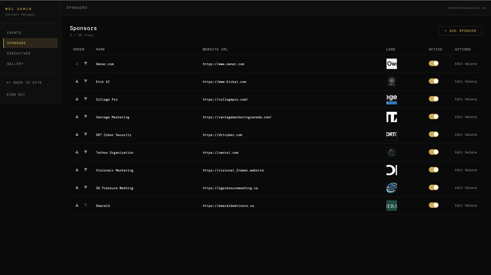

# Western Sales Club Website

This is the website for the Western Sales Club (WSC). This website establishes them as a key player in Western's club community, and helps them attract clients for their sales agency. 

This website is paired to a **Content Management System (CMS)** that allows them to authenticate to the **Admin Dashboard** that lets them update the dynamic content of the website, such as the events, executive team, photo gallery, and partners.

This is a full-stack application functioning as a frontend website connected to a **Supabase backend** accessed by the WSC executives via **OAuth 2.0**.

---

*Main Website (Frontend) Preview*

*Admin Dashboard (Backend) Preview*

---

This application was designed and built by TSI Team 4 (Winter 2025): 

**Project Managers**

  
  

**Developers**

  
  
  
  
  

