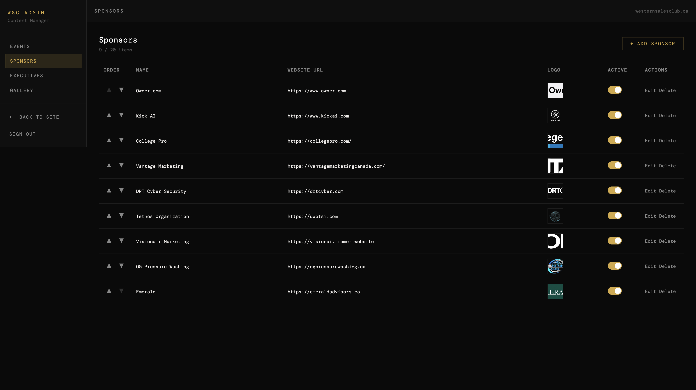

# Western Sales Club Website

This is the website for the Western Sales Club (WSC). This website establishes them as a key player in Western's club community, and helps them attract clients for their sales agency. 

This website is paired to a **Content Management System (CMS)**. Executives sign in to the **Admin Dashboard** at `/admin` and can edit the whole site without a developer: every piece of text, every photo, the statistics, events, executives and their roles, partners, and the admin roster itself. Page structure and section order stay in code.

This is a full-stack application: a Next.js frontend connected to a **Supabase backend**. Executives sign in with **Google** and must pass an **authenticator-app code (TOTP 2FA)** before they can change anything. Admin access is invite-only and expires after ten months. How access works, and the dashboard settings it depends on, are in [`supabase/README.md`](supabase/README.md).

---

*Main Website (Frontend) Preview*

*Admin Dashboard (Backend) Preview*

---

This application was designed and built by Tethos Team 4 (Winter 2025): 

**Project Managers**

  
  

**Developers**

  
  
  
  
  

